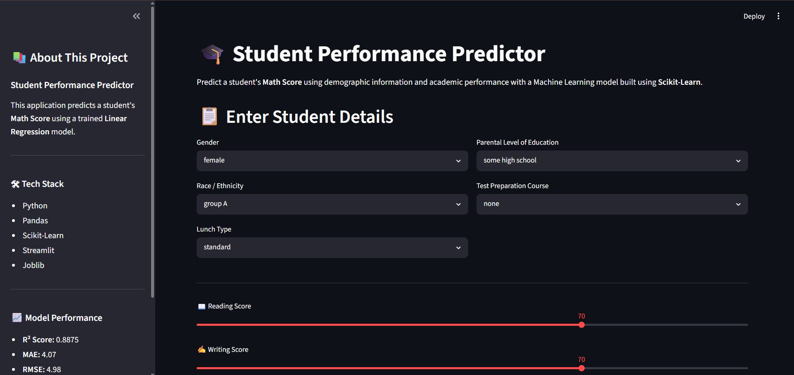
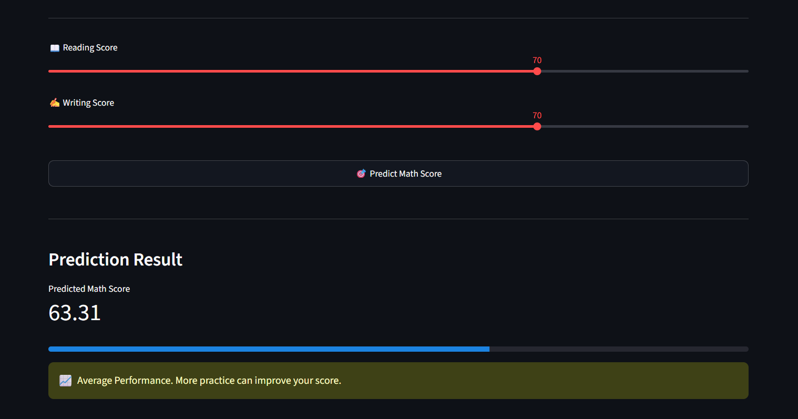

# 🎓 Student Performance Predictor

> An end-to-end Machine Learning web application that predicts a student's **Math Score** using demographic and academic information.


---

## 📖 Overview

Student Performance Predictor is an end-to-end Machine Learning application built using **Scikit-Learn** and **Streamlit**.

The application predicts a student's **Math Score** based on:

- Gender
- Race/Ethnicity
- Parental Level of Education
- Lunch Type
- Test Preparation Course
- Reading Score
- Writing Score

The project demonstrates the complete Machine Learning workflow—from **data preprocessing and model training** to **deployment as a web application**.

---

## 🚀 Live Demo

🔗 **Coming Soon**

*(Add your Streamlit deployment link here after deployment.)*

---

# ✨ Features

- 📊 Interactive Streamlit Dashboard
- 🤖 Machine Learning Prediction
- 📈 Real-time Score Prediction
- 📋 User-friendly Input Form
- 🎯 Performance Feedback
- 📦 Scikit-Learn Pipeline
- 💾 Saved ML Model using Joblib
- 📱 Responsive UI

---

# 🛠 Tech Stack

| Category | Technologies |
|----------|--------------|
| Programming Language | Python |
| Data Analysis | Pandas, NumPy |
| Visualization | Matplotlib, Seaborn |
| Machine Learning | Scikit-Learn |
| Deployment | Streamlit |
| Model Persistence | Joblib |
| Version Control | Git & GitHub |

---

# 📂 Project Structure

```text
student-performance-predictor/
│
├── data/
│   └── student_performance.csv
│
├── model/
│   └── student_performance_model.pkl
│
├── notebooks/
│   └── EDA.ipynb
│
├── screenshots/
│   ├── home.png
│   ├── prediction.png
│   └── eda.png
│
├── app.py
├── train.py
├── requirements.txt
├── README.md
└── .gitignore
```

---

# 📊 Exploratory Data Analysis

During the EDA phase, the following analyses were performed:

- Dataset Exploration
- Missing Value Analysis
- Feature Understanding
- Distribution Analysis
- Correlation Analysis
- Data Type Inspection

---

# 📈 Model Performance

| Metric | Value |
|--------|------:|
| R² Score | **0.8875** |
| Mean Absolute Error (MAE) | **4.07** |
| Root Mean Squared Error (RMSE) | **4.98** |

### Interpretation

- The model explains approximately **88.75%** of the variance in Math Scores.
- On average, predictions are within **4 marks** of the actual score.
- The model demonstrates strong predictive performance for this dataset.

---

# 🧠 Machine Learning Workflow

```text
Dataset
    │
    ▼
Exploratory Data Analysis
    │
    ▼
Data Preprocessing
    │
    ▼
One-Hot Encoding
    │
    ▼
Train-Test Split
    │
    ▼
Linear Regression Model
    │
    ▼
Model Evaluation
    │
    ▼
Model Serialization (Joblib)
    │
    ▼
Streamlit Web Application
```

---

## 🏠 Home Page



## 🎯 Prediction



## 📊 EDA


# ⚙ Installation

Clone the repository

```bash
git clone https://github.com/ArindamRout07/student-performance-predictor.git
```

Navigate into the project

```bash
cd student-performance-predictor
```

Install dependencies

```bash
pip install -r requirements.txt
```

Run the application

```bash
streamlit run app.py
```

---

# 🎯 Example Prediction

### Input

| Feature | Value |
|---------|-------|
| Gender | Male |
| Race | Group C |
| Parent Education | Bachelor's Degree |
| Lunch | Standard |
| Test Preparation | Completed |
| Reading Score | 90 |
| Writing Score | 92 |

### Output


Predicted Math Score : 89.72


---

# 💡 Future Improvements

- Compare multiple ML models
- Hyperparameter Tuning
- Feature Importance Visualization
- XGBoost & Random Forest Implementation
- Docker Containerization
- Cloud Deployment
- Authentication System
- Prediction History Dashboard
- Explainable AI using SHAP

---

# 🎓 Learning Outcomes

Through this project, I learned:

- Exploratory Data Analysis (EDA)
- Data Cleaning
- Feature Engineering
- One-Hot Encoding
- Train-Test Split
- Linear Regression
- Model Evaluation
- Scikit-Learn Pipelines
- Joblib Model Serialization
- Streamlit Deployment
- Git & GitHub Workflow

---

# 👨‍💻 Author

**Arindam Rout**

B.Tech CSE (Artificial Intelligence & Machine Learning)

GitHub: https://github.com/ArindamRout07

LinkedIn: www.linkedin.com/in/arindam-rout-7a016a353

---

# ⭐ Support

If you found this project helpful, consider giving it a ⭐ on GitHub!

---

